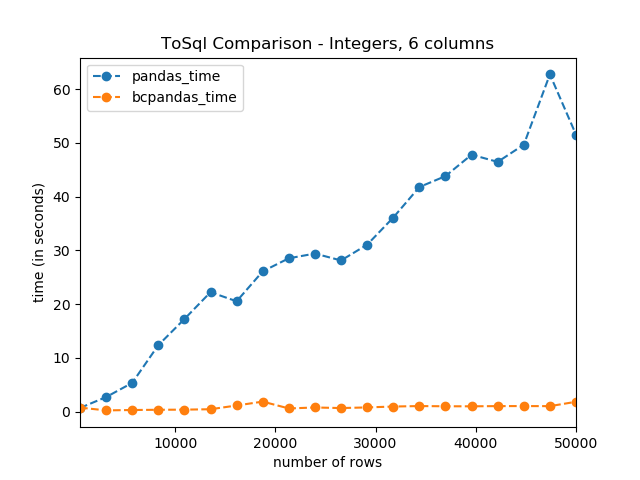

# bcpandas

[](https://github.com/psf/black)
[](https://pypi.org/project/bcpandas/)
[](https://anaconda.org/conda-forge/bcpandas)
[](https://github.com/yehoshuadimarsky/bcpandas/blob/master/LICENSE)
[](https://pypi.python.org/pypi/bcpandas/)
[](https://pypi.python.org/pypi/bcpandas/)
[](https://github.com/Naereen/badges)


High-level wrapper around BCP for high performance data transfers between pandas and SQL Server. No knowledge of BCP required!! (pronounced _BEE-CEE-Pandas_)

## Quickstart

```python
In [1]: import pandas as pd
   ...: import numpy as np
   ...: 
   ...: from bcpandas import SqlCreds, to_sql, read_sql

In [2]: creds = SqlCreds(
   ...:     'my_server',
   ...:     'my_db',
   ...:     'my_username',
   ...:     'my_password'
   ...: )

In [3]: df = pd.DataFrame(
   ...:         data=np.ndarray(shape=(10, 6), dtype=int), 
   ...:         columns=[f"col_{x}" for x in range(6)]
   ...:     )

In [4]: df
Out[4]: 
     col_0    col_1    col_2    col_3    col_4    col_5
0  4128860  6029375  3801155  5570652  6619251  7536754
1  4849756  7536751  4456552  7143529  7471201  7012467
2  6029433  6881357  6881390  7274595  6553710  3342433
3  6619228  7733358  6029427  6488162  6357104  6553710
4  7536737  7077980  6422633  7536732  7602281  2949221
5  6357104  7012451  6750305  7536741  7340124  7274610
6  7340141  6226036  7274612  7077999  6881387  6029428
7  6619243  6226041  6881378  6553710  7209065  6029415
8  6881378  6553710  7209065  7536743  7274588  6619248
9  6226030  7209065  6619231  6881380  7274612  3014770

In [5]: to_sql(df, 'my_test_table', creds, index=False, if_exists='replace')

In [6]: df2 = read_sql('my_test_table', creds)

In [7]: df2
Out[7]: 
     col_0    col_1    col_2    col_3    col_4    col_5
0  4128860  6029375  3801155  5570652  6619251  7536754
1  4849756  7536751  4456552  7143529  7471201  7012467
2  6029433  6881357  6881390  7274595  6553710  3342433
3  6619228  7733358  6029427  6488162  6357104  6553710
4  7536737  7077980  6422633  7536732  7602281  2949221
5  6357104  7012451  6750305  7536741  7340124  7274610
6  7340141  6226036  7274612  7077999  6881387  6029428
7  6619243  6226041  6881378  6553710  7209065  6029415
8  6881378  6553710  7209065  7536743  7274588  6619248
9  6226030  7209065  6619231  6881380  7274612  3014770
```
## Benchmarks

See figure below. All code is in the `/benchmarks` directory. Running the `benchmark.py` file will output a PNG image of the graph as well as a JSON file with the environment used to generate it.

This is very much a work in progress.

> For now, I only am focusing on the `to_sql` method.




### What about the new Pandas [`method='multi'`](https://pandas.pydata.org/pandas-docs/stable/user_guide/io.html#io-sql-method)?
It has some drawbacks. First, because SQL Server can only accept up to 2100 parameters in a query, you are forced to set the `chunksize` parameter to a very small number for it to work - generally a bi less then `2100/<number of columns>`. Also, it is still slower. See [here](https://stackoverflow.com/questions/50689082/to-sql-pyodbc-count-field-incorrect-or-syntax-error) and [here](https://github.com/mkleehammer/pyodbc/issues/217) for more discussion on this, and the recommendation to use a bulk insert tool such as BCP. SQL Server simply didn't design the regular `INSERT` statement to support huge amounts of data.

## Requirements
### Database
Any version of Microsoft SQL Server. Can be installed on-prem, in the cloud, on a VM, or the Azure SQL Database/Data Warehouse versions.
### Python User
- [BCP](https://docs.microsoft.com/en-us/sql/tools/bcp-utility) Utility
- Microsoft ODBC Driver **11, 13, 13.1, or 17** for SQL Server. See the [pyodbc docs](https://github.com/mkleehammer/pyodbc/wiki/Connecting-to-SQL-Server-from-Windows) for details.
- Python >= 3.6
- `pandas` >= 0.19
- `sqlalchemy` >= 1.1.4
- `pyodbc` as the [supported DBAPI](https://docs.sqlalchemy.org/en/lastest/dialects/mssql.html#dialect-mssql)
- Windows as the client OS
  - Linux and MacOS are theoretically compatible, but never tested

## Installation
Source | Command
:---: | :---:
PyPI | ```pip install bcpandas``` 
Conda| ```conda install -c conda-forge bcpandas```

## Usage
1. Create creds (see next section)
2. Replace any `df.to_sql(...)` in your code with `bcpandas.to_sql(df, ...)`
3. Replace any `pd.read_sql(...)` with `bcpandas.read_sql(...)`

That's it!

### Credential/Connection object
Bcpandas requires a `bcpandas.SqlCreds` object in order to use it, and also a `sqlalchemy.Engine`. The user has 2 options when constructing it.
1. Create the bcpandas `SqlCreds` object with just the minimum attributes needed (server, database, username, password), and bcpandas will create a full `Engine` object from this. It will use `pyodbc`, `sqlalchemy`, and the Microsoft ODBC Driver for SQL Server, and will store it in the `.engine` attribute.
    ```python
    In [1]: from bcpandas import SqlCreds

    In [2]: creds = SqlCreds('my_server', 'my_db', 'my_username', 'my_password')

    In [3]: creds.engine
    Out[3]: Engine(mssql+pyodbc:///?odbc_connect=Driver={ODBC Driver 17 for SQL Server};Server=tcp:my_server,1433;Database=my_db;UID=my_username;PWD=my_password)

    ```
2. Pass a full `Engine` object to the bcpandas `SqlCreds` object, and bcpandas will attempt to parse out the server, database, username, and password to pass to the command line utilities. If a DSN is used, this will fail.
    
    (continuing example above)
    ```python
    In [4]: creds2 = SqlCreds.from_engine(creds.engine)

    In [5]: creds2.engine
    Out[5]: Engine(mssql+pyodbc:///?odbc_connect=Driver={ODBC Driver 17 for SQL Server};Server=tcp:my_server,1433;Database=my_db;UID=my_username;PWD=my_password)

    In [6]: creds2
    Out[6]: SqlCreds(server='my_server', database='my_db', username='my_username', with_krb_auth=False, engine=Engine(mssql+pyodbc:///?odbc_connect=Driver={ODBC Driver 17 for SQL Server};Server=tcp:my_server,1433;Database=my_db;UID=my_username;PWD=my_password), password=[REDACTED])
    ```

### Recommended Usage

In General:

| Feature                                           |    Pandas native   |      BCPandas      |
|---------------------------------------------------|:------------------:|:------------------:|
| Super speed                                       |         :x:        | :white_check_mark: |
| Good for simple data types like numbers and dates |         :x:        | :white_check_mark: |
| Handle edge cases                                 | :white_check_mark: |         :x:        |
| Handle messy string data                          | :white_check_mark: |         :x:        |

`to_sql` specific:

| Feature                                           |    Pandas native   |      BCPandas      |
|---------------------------------------------------|:------------------:|:------------------:|
| Super speed                                       |         :x:        | :white_check_mark: |
| Only write to some columns in the SQL table       | :white_check_mark: |         :x:        |

`from_sql` specific:

_#TODO_

> built with the help of https://www.tablesgenerator.com/markdown_tables# and https://gist.github.com/rxaviers/7360908

## Known Issues

Here are some caveats and limitations of bcpandas. Hopefully they will be addressed in future releases
* In the `to_sql` function:
  * Bcpandas has been tested with all ASCII characters 32-127. Unicode characters beyond that range have not been tested.
  * For now, an empty string (`""`) in the dataframe becomes `NULL` in the SQL database instead of remaining an empty string. We will hopefully fix this soon.
  * If `append` is passed to the `if_exists` parameter, if the dataframe columns don't match the SQL table columns exactly by both name and order, it will fail.
  * ~~If there is a NaN/Null in the last column of the dataframe it will throw an error. This is due to a BCP issue. See my issue with Microsoft about this [here](https://github.com/MicrosoftDocs/sql-docs/issues/2689).~~ This doesn't seem to be a problem based on the tests.
  * Because bcpandas first outputs to CSV, it needs to use several specific characters to create the CSV, including a _delimiter_ and a _quote character_. Bcpandas attempts to use  characters that are not present in the dataframe for this, going through the possilbe delimiters and quote characters specified in `constants.py`. If all possible characters are present in the dataframe and bcpandas cannot find both a delimiter and quote character to use, it will throw an error. 
    * The BCP utility does __not__ ignore delimiter characters when surrounded by quotes, unlike CSVs - see [here](https://docs.microsoft.com/en-us/sql/relational-databases/import-export/specify-field-and-row-terminators-sql-server#characters-supported-as-terminators) in the Microsoft docs.

## Background
Reading and writing data from pandas DataFrames to/from a SQL database is very slow using the built-in `read_sql` and `to_sql` methods, even with the newly introduced [`execute_many`](https://pandas.pydata.org/pandas-docs/stable/user_guide/io.html#io-sql-method) option. For Microsoft SQL Server, a far far faster method is to use the BCP utility provided by Microsoft. This utility is a command line tool that transfers data to/from the database and flat text files.

This package is a wrapper for seamlessly using the bcp utility from Python using a pandas DataFrame. Despite the IO hits, the fastest option by far is saving the data to a CSV file in the file system and using the bcp utility to transfer the CSV file to SQL Server. **Best of all, you don't need to know anything about using BCP at all!**

### Existing Solutions
> Much credit is due to `bcpy` for the original idea and for some of the code that was adopted and changed.
<details>
  <summary>bcpy</summary>

  [bcpy](https://github.com/titan550/bcpy) has several flaws:
  * No support for reading from SQL, only writing to SQL
  * A convoluted, overly class-based internal design
  * Scope a bit too broad - deals with pandas as well as flat files
  This repository aims to fix and improve on `bcpy` and the above issues by making the design choices described earlier.
</details>

### Design and Scope
The _**only**_ scope of `bcpandas` is to read and write between a pandas DataFrame and a Microsoft SQL Server database. That's it. We do _**not**_ concern ourselves with reading existing flat files to/from SQL - that introduces _way_ to much complexity in trying to parse and decode the various parts of the file, like delimiters, quote characters, and line endings. Instead, to read/write an exiting flat file, just import it via pandas into a DataFrame, and then use `bcpandas`.

The big benefit of this is that we get to precicely control all the finicky parts of the text file when we write/read it to a local file and then in the BCP utility. This lets us set library-wide defaults (maybe configurable in the future) and work with those.

For now, we are using the non-XML BCP format file type. In the future, XML format files may be added.


## Testing
Testing uses `pytest`. A local SQL Server is spun up using Docker.

## Contributing
Please, all contributions are very welcome! 

I will attempt to use the `pandas` docstring style as detailed [here](https://pandas.pydata.org/pandas-docs/stable/development/contributing_docstring.html).
