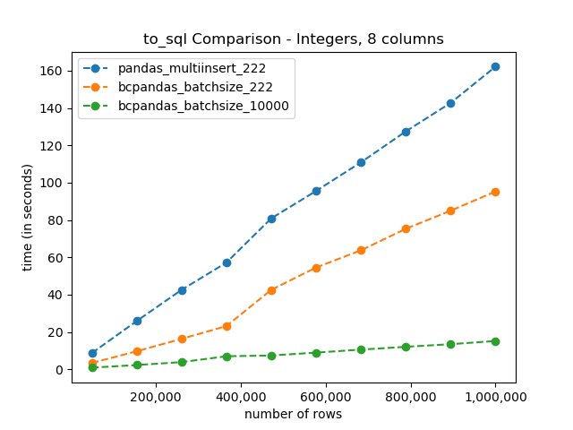
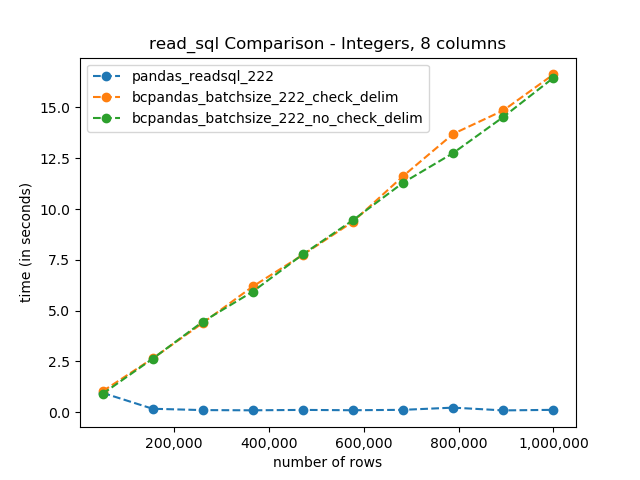

# bcpandas

[](https://pypi.org/project/bcpandas/)
[](https://anaconda.org/conda-forge/bcpandas)
[](https://github.com/yehoshuadimarsky/bcpandas/blob/master/LICENSE)
[](https://github.com/yehoshuadimarsky/bcpandas/actions/workflows/ci.yml)
[](https://codecov.io/gh/yehoshuadimarsky/bcpandas)
[](https://github.com/psf/black)
[](https://pypi.python.org/pypi/bcpandas/)
[](https://github.com/Naereen/badges)
[](https://pepy.tech/project/bcpandas)
[](https://results.pre-commit.ci/latest/github/yehoshuadimarsky/bcpandas/master)

High-level wrapper around BCP for high performance data transfers between pandas and SQL Server. No
knowledge of BCP required!! (pronounced _BEE-CEE-Pandas_)

<!-- START doctoc generated TOC please keep comment here to allow auto update -->
<!-- DON'T EDIT THIS SECTION, INSTEAD RE-RUN doctoc TO UPDATE -->

- [Quickstart](#quickstart)
- [IMPORTANT - Read vs. Write](#important---read-vs-write)
- [Benchmarks](#benchmarks)
  - [to_sql](#to_sql)
    - [Why not just use the new pandas `method='multi'`?](#why-not-just-use-the-new-pandas-methodmulti)
  - [read_sql](#read_sql)
- [Requirements](#requirements)
  - [Database](#database)
  - [Python User](#python-user)
- [Installation](#installation)
- [Usage](#usage)
  - [Credential/Connection object](#credentialconnection-object)
  - [Recommended Usage](#recommended-usage)
- [Known Issues](#known-issues)
  - [Troubleshooting](#troubleshooting)
    - [All quote characters appear in the data](#all-quote-characters-appear-in-the-data)
    - [All delimiter characters appear in the data](#all-delimiter-characters-appear-in-the-data)
    - [Write to database fails due to spaces in columns](#write-to-database-fails-due-to-spaces-in-columns)
- [Background](#background)
  - [Existing Solutions](#existing-solutions)
  - [Design and Scope](#design-and-scope)
- [Testing](#testing)
  - [Testing Requirements](#testing-requirements)
  - [What Is Tested?](#what-is-tested)
  - [Testing Implementation](#testing-implementation)
- [CI/CD](#cicd)
- [Contributing](#contributing)
- [GitHub Stars Trend](#github-stars-trend)

<!-- END doctoc generated TOC please keep comment here to allow auto update -->

## Quickstart

```python
In [1]: import pandas as pd
   ...: import numpy as np
   ...:
   ...: from bcpandas import SqlCreds, to_sql

In [2]: creds = SqlCreds(
   ...:     'my_server',
   ...:     'my_db',
   ...:     'my_username',
   ...:     'my_password'
   ...: )

In [3]: df = pd.DataFrame(
   ...:         data=np.ndarray(shape=(10, 6), dtype=int),
   ...:         columns=[f"col_{x}" for x in range(6)]
   ...:     )

In [4]: df
Out[4]:
     col_0    col_1    col_2    col_3    col_4    col_5
0  4128860  6029375  3801155  5570652  6619251  7536754
1  4849756  7536751  4456552  7143529  7471201  7012467
2  6029433  6881357  6881390  7274595  6553710  3342433
3  6619228  7733358  6029427  6488162  6357104  6553710
4  7536737  7077980  6422633  7536732  7602281  2949221
5  6357104  7012451  6750305  7536741  7340124  7274610
6  7340141  6226036  7274612  7077999  6881387  6029428
7  6619243  6226041  6881378  6553710  7209065  6029415
8  6881378  6553710  7209065  7536743  7274588  6619248
9  6226030  7209065  6619231  6881380  7274612  3014770

In [5]: to_sql(df, 'my_test_table', creds, index=False, if_exists='replace')

In [6]: df2 = pd.read_sql_table(table_name='my_test_table', con=creds.engine)

In [7]: df2
Out[7]:
     col_0    col_1    col_2    col_3    col_4    col_5
0  4128860  6029375  3801155  5570652  6619251  7536754
1  4849756  7536751  4456552  7143529  7471201  7012467
2  6029433  6881357  6881390  7274595  6553710  3342433
3  6619228  7733358  6029427  6488162  6357104  6553710
4  7536737  7077980  6422633  7536732  7602281  2949221
5  6357104  7012451  6750305  7536741  7340124  7274610
6  7340141  6226036  7274612  7077999  6881387  6029428
7  6619243  6226041  6881378  6553710  7209065  6029415
8  6881378  6553710  7209065  7536743  7274588  6619248
9  6226030  7209065  6619231  6881380  7274612  3014770
```

## IMPORTANT - Read vs. Write

The big speedup benefit of bcpandas is in the `to_sql` function, as the benchmarks below show.
However, the bcpandas `read_sql` function actually performs **slower** than the pandas equivalent.
Therefore, the bcpandas `read_sql` function was deprecated in v5.0 and has now been removed in
v6.0+. To read data **from** SQL to pandas, use the native pandas method `pd.read_sql_table` or
`pd.read_sql_query`.

## Benchmarks

See figures below. All code is in the `/benchmarks` directory. To run the benchmarks, from the root
directory of this repository, run `python benchmarks/benchmark.py main --help` and fill in the
command line options that are presented.

Running this will output

1. PNG image of the graph
2. JSON file of the benchmark data
3. JSON file with the environment details of the machine that was used to generate it

### to_sql

> I didn't bother including the pandas non-`multiinsert` version here because it just takes way too
> long



#### Why not just use the new pandas [`method='multi'`](https://pandas.pydata.org/pandas-docs/stable/user_guide/io.html#io-sql-method)?

1. Because it is still much slower
2. Because you are forced to set the `chunksize` parameter to a very small number for it to work -
   generally a bit less then `2100/<number of columns>`. This is because SQL Server can only accept
   up to 2100 parameters in a query. See
   [here](https://stackoverflow.com/questions/50689082/to-sql-pyodbc-count-field-incorrect-or-syntax-error)
   and [here](https://github.com/mkleehammer/pyodbc/issues/217) for more discussion on this, and
   the recommendation to use a bulk insert tool such as BCP. It seems that SQL Server simply didn't
   design the regular `INSERT` statement to support huge amounts of data.

### read_sql

As you can see, pandas native clearly wins here



## Requirements

### Database

Any version of Microsoft SQL Server. Can be installed on-prem, in the cloud, on a VM, or one of the
Azure versions.

### Python User

- [BCP](https://docs.microsoft.com/en-us/sql/tools/bcp-utility) Utility
- Microsoft ODBC Driver **11, 13, 13.1, or 17** for SQL Server.
  ([Microsoft Docs](https://docs.microsoft.com/en-us/sql/connect/odbc/download-odbc-driver-for-sql-server))
  See the
  [pyodbc docs](https://github.com/mkleehammer/pyodbc/wiki/Connecting-to-SQL-Server-from-Windows)
  for more on different driver versions.
- Python >= 3.8
- `pandas` >= 1.5
- `sqlalchemy` >= 1.4
- `pyodbc` as the
  [supported DBAPI](https://docs.sqlalchemy.org/en/13/dialects/mssql.html#module-sqlalchemy.dialects.mssql.pyodbc)

## Installation

| Source |                 Command                 |
| :----: | :-------------------------------------: |
|  PyPI  |         `pip install bcpandas`          |
| Conda  | `conda install -c conda-forge bcpandas` |

## Usage

1. Create creds (see next section)
2. Replace any `df.to_sql(...)` in your code with `bcpandas.to_sql(df, ...)`

That's it!

### Credential/Connection object

Bcpandas requires a `bcpandas.SqlCreds` object in order to use it, and also a `sqlalchemy.Engine`.
The user has 2 options when constructing it.

1. Create the bcpandas `SqlCreds` object with just the minimum attributes needed (server, database,
   username, password), and bcpandas will create a full `Engine` object from this. It will use
   `pyodbc`, `sqlalchemy`, and the Microsoft ODBC Driver for SQL Server, and will store it in the
   `.engine` attribute.

   ```python
   In [1]: from bcpandas import SqlCreds

   In [2]: creds = SqlCreds('my_server', 'my_db', 'my_username', 'my_password')

   In [3]: creds.engine
   Out[3]: Engine(mssql+pyodbc:///?odbc_connect=Driver={ODBC Driver 17 for SQL Server};Server=tcp:my_server,1433;Database=my_db;UID=my_username;PWD=my_password)

   ```

2. Pass a full `Engine` object to the bcpandas `SqlCreds` object, and bcpandas will attempt to
   parse out the server, database, username, and password to pass to the command line utilities. If
   a DSN is used, this will fail.

   (continuing example above)

   ```python
   In [4]: creds2 = SqlCreds.from_engine(creds.engine)

   In [5]: creds2.engine
   Out[5]: Engine(mssql+pyodbc:///?odbc_connect=Driver={ODBC Driver 17 for SQL Server};Server=tcp:my_server,1433;Database=my_db;UID=my_username;PWD=my_password)

   In [6]: creds2
   Out[6]: SqlCreds(server='my_server', database='my_db', username='my_username', with_krb_auth=False, engine=Engine(mssql+pyodbc:///?odbc_connect=Driver={ODBC Driver 17 for SQL Server};Server=tcp:my_server,1433;Database=my_db;UID=my_username;PWD=my_password), password=[REDACTED])
   ```

### Recommended Usage

| Feature                                           |   Pandas native    |      BCPandas      |
| ------------------------------------------------- | :----------------: | :----------------: |
| Super speed                                       |        :x:         | :white_check_mark: |
| Good for simple data types like numbers and dates |        :x:         | :white_check_mark: |
| Handle messy string data                          | :white_check_mark: |        :x:         |

> built with the help of https://www.tablesgenerator.com/markdown_tables# and
> https://gist.github.com/rxaviers/7360908

## Known Issues

Here are some caveats and limitations of bcpandas.

- Bcpandas has been tested with all ASCII characters 32-127. Unicode characters beyond that range
  have not been tested.
- An empty string (`""`) in the dataframe becomes `NULL` in the SQL database instead of remaining
  an empty string.
- Because bcpandas first outputs to CSV, it needs to use several specific characters to create the
  CSV, including a _delimiter_ and a _quote character_. Bcpandas attempts to use characters that
  are not present in the dataframe for this, going through the possilbe delimiters and quote
  characters specified in `constants.py`. If all possible characters are present in the dataframe
  and bcpandas cannot find both a delimiter and quote character to use, it will throw an error.
  - The BCP utility does **not** ignore delimiter characters when surrounded by quotes, unlike
    CSVs - see
    [here](https://docs.microsoft.com/en-us/sql/relational-databases/import-export/specify-field-and-row-terminators-sql-server#characters-supported-as-terminators)
    in the Microsoft docs.
- ~~If there is a NaN/Null in the last column of the dataframe it will throw an error. This is due
  to a BCP issue. See my issue with Microsoft about this
  [here](https://github.com/MicrosoftDocs/sql-docs/issues/2689).~~ This doesn't seem to be a
  problem based on the tests.

### Troubleshooting

#### All quote characters appear in the data

If you encounter the error:
```
bcpandas.constants.BCPandasValueError: Data contains all of the possible quote characters ('"', "'", '`', '~'),
cannot use BCP to import it. Replace one of the possible quote characters in
your data, or use another method besides bcpandas.
```

And want to still use BCPandas, you will need to pick a quote character and remove all instances of it from the dataframe.  Note
that you are modifying your data and take care that replacing e.g., the `~` character will not have undesired consequences.

In this case we are looking to remove `~`, replacing it with `-`.  Hunt for its presence in a column:
```
my_df['some_text_column'].str.contains('~').sum()
```
If that returns a value greater than zero, you can perform replacement in that column like this:
```
my_df['some_text_column'] = my_df['some_text_column'].str.replace('~','-')
```
Then use the first command to confirm that the number of occurences is now 0.

#### All delimiter characters appear in the data

Very similar to above, but with the error message:
```
bcpandas.constants.BCPandasValueError: Data contains all of the possible delimiter characters (',', '|', '\t'),
cannot use BCP to import it. Replace one of the possible delimiter characters in
your data, or use another method besides bcpandas.
```

Approach this as is described above for quote characters.  If you target the `|` character for replacement, note that it
must be escaped in a regular expression with a backslash.  So the relevant commands would be (here the pipe `|` is replaced with a front slash):
```
my_df['some_text_column'] = my_df['some_text_column'].str.replace('\|','/')
my_df['some_text_column'].str.contains('\|').sum()
```

#### Write to database fails due to spaces in columns

If you get this error message when writing to the database:
```
Error = [Microsoft][ODBC Driver 17 for SQL Server]Incorrect host-column number found in BCP format-file
```
Try replacing any space characters in your column names, with a command like `my_df.columns = my_df.columns.str.replace(' ','_')` ([source](https://github.com/yehoshuadimarsky/bcpandas/issues/30)).

## Background

Writing data from pandas DataFrames to a SQL database is very slow using the built-in `to_sql`
method, even with the newly introduced
[`execute_many`](https://pandas.pydata.org/pandas-docs/stable/user_guide/io.html#io-sql-method)
option. For Microsoft SQL Server, a far far faster method is to use the BCP utility provided by
Microsoft. This utility is a command line tool that transfers data to/from the database and flat
text files.

This package is a wrapper for seamlessly using the bcp utility from Python using a pandas
DataFrame. Despite the IO hits, the fastest option by far is saving the data to a CSV file in the
file system and using the bcp utility to transfer the CSV file to SQL Server. **Best of all, you
don't need to know anything about using BCP at all!**

### Existing Solutions

> Much credit is due to `bcpy` for the original idea and for some of the code that was adopted and
> changed.

<details>
  <summary>bcpy</summary>

[bcpy](https://github.com/titan550/bcpy) has several flaws:

- No support for reading from SQL, only writing to SQL
- A convoluted, overly class-based internal design
- Scope a bit too broad - deals with pandas as well as flat files This repository aims to fix and
improve on `bcpy` and the above issues by making the design choices described earlier.
</details>

### Design and Scope

The _**only**_ scope of `bcpandas` is to read and write between a pandas DataFrame and a Microsoft
SQL Server database. That's it. We do _**not**_ concern ourselves with reading existing flat files
to/from SQL - that introduces _way_ to much complexity in trying to parse and decode the various
parts of the file, like delimiters, quote characters, and line endings. Instead, to read/write an
exiting flat file, just import it via pandas into a DataFrame, and then use `bcpandas`.

The big benefit of this is that we get to precicely control all the finicky parts of the text file
when we write/read it to a local file and then in the BCP utility. This lets us set library-wide
defaults (maybe configurable in the future) and work with those.

For now, we are using the non-XML BCP format file type. In the future, XML format files may be
added.

## Testing

### Testing Requirements

- Docker Desktop installed, either of the Linux or Windows runtimes, doesn't matter
- pytest
- hypothesis
- pytest-cov (coverage.py)

### What Is Tested?

We take testing very seriously here. In order to rely on a library like this in production, it
**MUST** be ruthlessly tested, which thankfully it is. Here is a partial list of what has been
tested so far. Pull Requests welcome!

- Data types: All ASCII characters 32-127 (using the Hypothesis library, see below). Unicode
  characters beyond that range have not been tested.
- `numpy.NaN`, `None`
- `numpy.inf` (fails, as expected)
- Empty dataframe (nothing happens, database not modified)
- Duplicate column names (raises error)
- Database columns that are missing from the dataframe, are out of order, or both (passes)
- Extra dataframe columns that aren't in database, when `if_exists="append"` specified (fails)

### Testing Implementation

- Testing uses `pytest`.
- To test for all possible data types, we use the `hypothesis` library, instead of trying to come
  up with every single case on our own.
- `pytest-cov` (which uses `coverage.py` under the hood) is used to measure code coverage. This is
  then uploaded to [codecov.io](https://codecov.io/gh/yehoshuadimarsky/bcpandas) as part of the
  CI/CD process (see below).
- In order to spin up a local SQL Server during testing, we use Docker. Specifically, we run one of
  the images that Microsoft provides that already have SQL Server fully installed, all we have to
  do is use the image to run a container. Here are the links to the
  [Linux versions](https://hub.docker.com/_/microsoft-mssql-server) and the Windows versions -
  [Express](https://hub.docker.com/r/microsoft/mssql-server-windows-express/) and
  [Developer](https://hub.docker.com/r/microsoft/mssql-server-windows-developer).
  - When running the tests, we can specify a specific Docker image to use, by invoking the custom
    command line option called `--mssql-docker-image`. For example:
    ```bash
    pytest bcpandas/tests --mssql-docker-image mcr.microsoft.com/mssql/server:2019-latest
    ```
- Instead of using the `subprocess` library to control Docker manually, we use the elegant
  `docker-py` library which works very nicely. A `DockerDB` Python class is defined in
  `bcpandas/tests/utils.py` and it wraps up all the Docker commands and functionality needed to use
  SQL Server into one class. This class is used in `conftest.py` in the core bcpandas tests, and in
  the `benchmarks/` directory for both the benchmarks code as well as the legacy tests for
  `read_sql`.

## CI/CD

Github Actions is used for CI/CD, although it is still somewhat a work in progress.

## Contributing

Please, all contributions are very welcome!

I will attempt to use the `pandas` docstring style as detailed
[here](https://pandas.pydata.org/pandas-docs/stable/development/contributing_docstring.html).

## GitHub Stars Trend

[](https://starchart.cc/yehoshuadimarsky/bcpandas)
